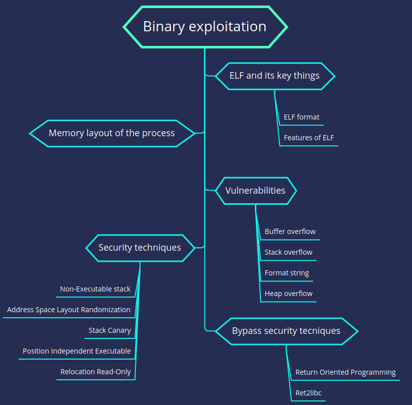

# basics-of-pwn

My course work about a basic binary exploitation.

## <b>Table of Contents</b>

- [Memory layout of the process](content/memory-layout.md "https://github.com/whatsyourask/basics-of-pwn/blob/main/content/memory-layout.md")
- [ELF and its key things]
  * [ELF format]
  * [Features of ELF]
- [Vulnerabilities types]
  * [Buffer overflow]
  * [Stack overflow]
    * [Jump to arbitrary address]
    * [Shellcode writing]
    * [NOP chain]
    * [Easy exploit of the stack overflow with python pwntools module]
  * [Format string vulnerabilities]
    * [Format string specifiers]
    * [Read arbitrary data]
    * [Exploitation]
  * [Heap overflow]
- [Security techniques]
  * [Non-Executable Stack(NX)]
  * [Address Space Layout Randomization(ASLR)]
  * [Stack canary]
  * [Position Independent Executable(PIE)]
